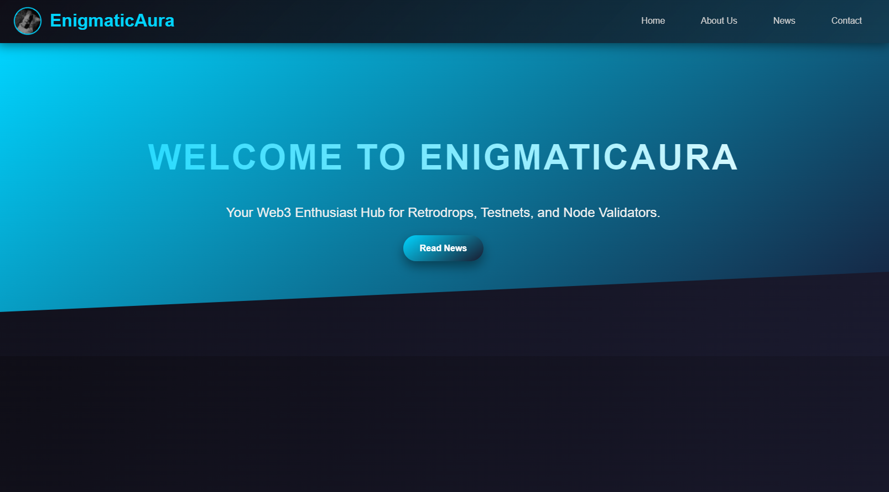
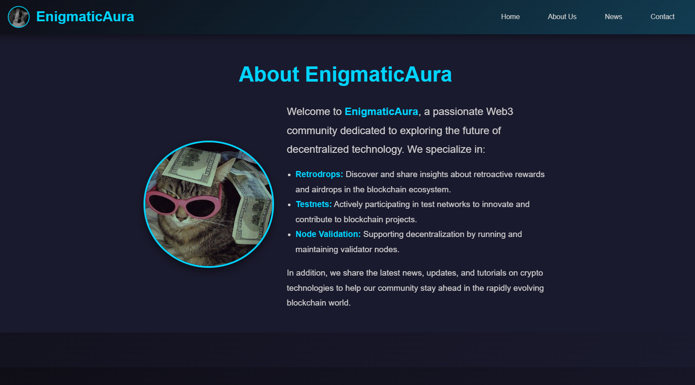
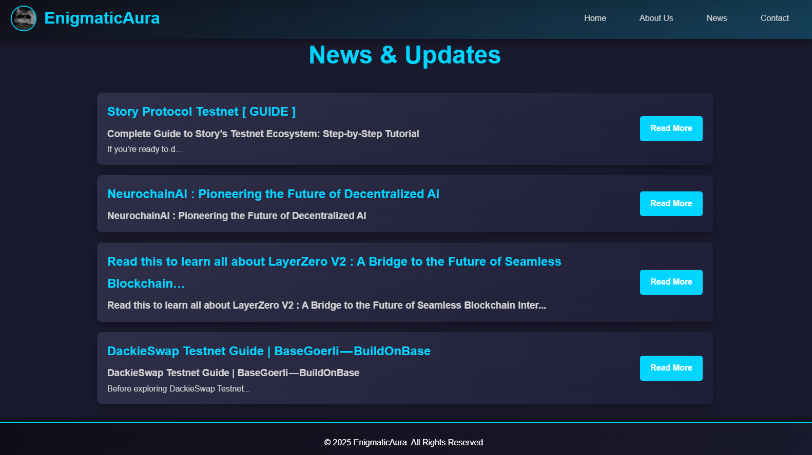
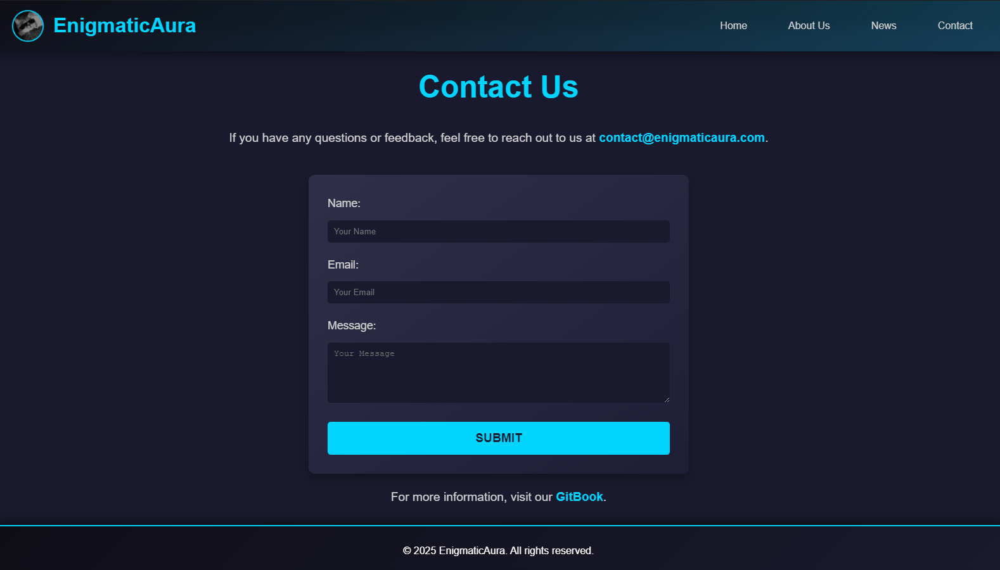

# **Enigma: Web3 Enthusiast Hub for Retrodrops, Testnets, and Node Validators**

**Enigma** is a Web3-based platform designed for blockchain enthusiasts and decentralized technology supporters. Offering up-to-date information on retrodrops, testnets, and node validators, Enigma is the go-to place for those looking to stay ahead in the Web3 world.

🔗 **Website**: [Enigma Web3 Hub](https://eimccuo6prmsuifxzpkktldhz53svdfwgj2dtbfq6rzo73zn3v3a.arweave.net/IhghUd58WSogt8vUqaxnz3cqjLYydDmEsPRy7-8t3XY/index.html)

## **Main Features**

- **Retrodrops**: Provides information about retrodrops that can help you gain airdrops or benefits from Web3 protocols.
- **Testnets**: A platform to follow the latest testnet developments and how to contribute.
- **Node Validators**: Information about node validators that help enhance network decentralization.
- **Latest News**: Stay updated with the latest news in the Web3 space.
  
## **Screenshots**

### Home

### About

### News

### Contact

## **Usage Instructions**

1. Access the website through [Enigma Web3 Hub](https://eimccuo6prmsuifxzpkktldhz53svdfwgj2dtbfq6rzo73zn3v3a.arweave.net/IhghUd58WSogt8vUqaxnz3cqjLYydDmEsPRy7-8t3XY/index.html).
2. Explore sections such as **Retrodrops**, **Testnets**, and **Node Validators** to get the latest updates.
3. Visit the **About** page to learn more about this project.
4. Check the **News** page for the latest updates in the Web3 world.
5. Contact our team through the **Contact** page for any inquiries.

## **Project Structure**

- `assets/css/style.css`: Styles for the website.
- `assets/images/`: Contains images used in the website.
- `src/about.html`: About Us page.
- `src/contact.html`: Contact page.
- `src/news.html`: News page.
- `index.html`: Home page.

## **Deploying to DragonDeploy**

### 1. Preparing Your Project

Before deploying, ensure that your project includes the necessary files and folders in your project directory. Once you have confirmed this, you can visit DragonDeploy.

### 2. Connecting and Setting Wallet Permissions

Before uploading your project files, make sure to configure your wallet permissions. You can visit the "Setting Permissions" section for guidance.

### 3. Uploading Your Files

Drag and drop your project folder directly into DragonDeploy. After that, verify your project with your wallet. Press accept to confirm the project. Once the upload is complete, a link will appear to access your project.

## **Contributing**

If you wish to contribute to this project, please follow these steps:

1. Fork this repository.
2. Create a new branch for your feature or fix.
3. Add documentation if necessary.
4. Submit a pull request for review and integration.
